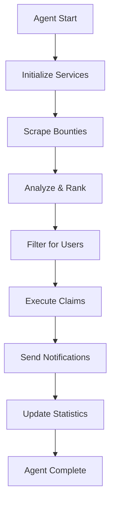

# BountyHunter AI+ - Autonomous Web3 Bounty-Hunting Agent

A production-grade AI-powered crypto bounty-hunting web app that automatically finds, filters, and claims real crypto/Web3 bounties for users using the Mosaia GitHub App platform.

## 🚀 Features

- **Mosaia AI Agent**: Deployed via Mosaia GitHub App for autonomous operation
- **Real Bounty Scraping**: Uses Exa API to scrape live bounties from Gitcoin, Layer3, Dework, and Superteam
- **On-Chain Auto-Claiming**: Executes real blockchain transactions to claim bounties
- **AI-Powered Analysis**: Intelligent bounty ranking and recommendation system
- **Wallet-Only Authentication**: Secure wallet-based authentication using RainbowKit
- **Multi-Chain Support**: Works across Ethereum, Solana, Polygon, Arbitrum, and Optimism
- **Real-Time Monitoring**: Live updates on bounty status and new opportunities
- **Custom Dataset**: Stores unique bounty data in Supabase with advanced analytics
- **Notifications**: Slack, Discord, and Telegram alerts for successful claims
- **Mobile-Responsive**: Fully responsive design for all devices

## 🛠 Technology Stack

### Core Technologies (Required)
- **Mosaia GitHub App**: Agent deployment and scheduling
- **Exa API**: Advanced web scraping for bounty platforms
- **Supabase**: PostgreSQL database with RLS and edge functions
- **Ethers.js**: Ethereum blockchain interactions
- **Solana Web3.js**: Solana blockchain interactions
- **React + Vite**: Frontend framework with fast development
- **RainbowKit**: Multi-wallet authentication
- **Tailwind CSS**: Utility-first CSS framework

### Optional Integrations
- **Filecoin/IPFS**: Decentralized storage for bounty metadata (bonus feature)
- **Tavily/Firecrawl**: Alternative scraping tools
- **pgvector**: AI-powered recommendations

## 📦 Installation & Setup

### 1. Clone the Repository
```bash
git clone https://github.com/yourusername/bountyhunter-ai.git
cd bountyhunter-ai
```

### 2. Install Dependencies
```bash
# Install frontend dependencies
npm install

# Install agent dependencies
cd agent
npm install
cd ..
```

### 3. Environment Configuration
```bash
cp .env.example .env
```

Fill in your environment variables:
```env
# Supabase Configuration
VITE_SUPABASE_URL=your-supabase-url
VITE_SUPABASE_ANON_KEY=your-supabase-anon-key
SUPABASE_SERVICE_ROLE_KEY=your-service-role-key

# Wallet Connect
VITE_WALLET_CONNECT_PROJECT_ID=your-wallet-connect-project-id

# Exa API (Required for scraping)
EXA_API_KEY=your-exa-api-key

# Blockchain RPC URLs
VITE_ETHEREUM_RPC_URL=https://mainnet.infura.io/v3/your-infura-key
VITE_POLYGON_RPC_URL=https://polygon-mainnet.infura.io/v3/your-infura-key
VITE_ARBITRUM_RPC_URL=https://arbitrum-mainnet.infura.io/v3/your-infura-key
VITE_OPTIMISM_RPC_URL=https://optimism-mainnet.infura.io/v3/your-infura-key
VITE_SOLANA_RPC_URL=https://api.mainnet-beta.solana.com

# Agent Wallet (Use secure key management in production)
AGENT_PRIVATE_KEY=your-agent-private-key
AGENT_SOLANA_ADDRESS=your-agent-solana-address

# Notifications (Optional)
SLACK_WEBHOOK_URL=your-slack-webhook
DISCORD_WEBHOOK_URL=your-discord-webhook
TELEGRAM_BOT_TOKEN=your-telegram-bot-token
TELEGRAM_CHAT_ID=your-telegram-chat-id
```

### 4. Supabase Setup

1. **Create a Supabase Project**: Go to [supabase.com](https://supabase.com) and create a new project

2. **Run Database Migrations**:
   ```sql
   -- Copy and execute the SQL from supabase/migrations/20250706193258_lively_firefly.sql
   -- This creates all necessary tables, indexes, and RLS policies
   ```

3. **Deploy Edge Functions**:
   ```bash
   # Install Supabase CLI
   npm install -g supabase

   # Login to Supabase
   supabase login

   # Link your project
   supabase link --project-ref your-project-ref

   # Deploy edge functions
   supabase functions deploy wallet-auth
   supabase functions deploy auto-claim-trigger
   ```

### 5. Mosaia Agent Setup

1. **Install Mosaia CLI**:
   ```bash
   npm install -g @mosaia/cli
   ```

2. **Login to Mosaia**:
   ```bash
   mosaia login
   ```

3. **Deploy the Agent**:
   ```bash
   mosaia deploy
   ```

4. **Configure Agent Schedule**:
   The agent is configured to run every 6 hours via the `.mosaia-config.json` file.

### 6. Start Development Server
```bash
npm run dev
```

## 🤖 Mosaia Agent Architecture

### Agent Components

1. **BountyAgent** (`agent/bountyAgent.js`): Main orchestrator
2. **ScrapingService** (`agent/scrapingService.js`): Bounty discovery using Exa API
3. **ClaimingService** (`agent/claimingService.js`): On-chain transaction execution
4. **DatabaseService** (`agent/databaseService.js`): Supabase data management
5. **NotificationService** (`agent/notificationService.js`): Multi-platform notifications

### Agent Workflow



### Scraping Strategy

The agent uses Exa API to discover bounties from multiple platforms:

1. **Gitcoin**: Direct API calls + Exa search for recent bounties
2. **Layer3**: Exa search for active quests with rewards
3. **Dework**: GraphQL API + Exa backup search
4. **Superteam**: Exa search for Solana ecosystem bounties

### Claiming Strategy

1. **Validation**: On-chain verification of bounty status
2. **Gas Estimation**: Calculate optimal gas prices
3. **Transaction Execution**: Submit claiming transactions
4. **Confirmation**: Wait for transaction confirmation
5. **Recording**: Update database with claim results

## 🔐 Security & Best Practices

### Wallet Security
- Use hardware wallets for agent private keys in production
- Implement multi-signature wallets for high-value operations
- Regular key rotation and access audits

### Database Security
- Row Level Security (RLS) enabled on all tables
- Wallet-based authentication only
- Encrypted sensitive data storage

### Agent Security
- Rate limiting between claims
- Transaction validation before execution
- Error handling and recovery mechanisms
- Comprehensive logging and monitoring

## 📊 Database Schema

### Core Tables

```sql
-- Bounties: All discovered bounties
CREATE TABLE bounties (
  id text PRIMARY KEY,
  title text NOT NULL,
  description text,
  reward numeric DEFAULT 0,
  reward_token text DEFAULT 'USDC',
  chain text NOT NULL,
  platform text NOT NULL,
  category text NOT NULL,
  difficulty text DEFAULT 'intermediate',
  deadline timestamptz,
  claimable boolean DEFAULT true,
  claimed boolean DEFAULT false,
  claimed_by text,
  requirements text[] DEFAULT '{}',
  submission_url text,
  contract_address text,
  created_at timestamptz DEFAULT now(),
  updated_at timestamptz DEFAULT now(),
  tags text[] DEFAULT '{}'
);

-- Users: User profiles and preferences
CREATE TABLE users (
  id uuid PRIMARY KEY DEFAULT gen_random_uuid(),
  wallet_address text UNIQUE NOT NULL,
  chain text NOT NULL,
  total_earned numeric DEFAULT 0,
  total_claimed integer DEFAULT 0,
  rank integer DEFAULT 0,
  joined_at timestamptz DEFAULT now(),
  preferences jsonb DEFAULT '{
    "autoClaimEnabled": false,
    "notificationsEnabled": true,
    "chains": ["ethereum"],
    "categories": ["development"],
    "minReward": 0,
    "maxReward": 10000
  }'::jsonb
);

-- Transactions: Claim history and status
CREATE TABLE transactions (
  id uuid PRIMARY KEY DEFAULT gen_random_uuid(),
  user_id text NOT NULL,
  bounty_id text NOT NULL,
  type text NOT NULL CHECK (type IN ('claim', 'auto-claim')),
  amount numeric NOT NULL,
  token text NOT NULL,
  chain text NOT NULL,
  tx_hash text NOT NULL,
  status text DEFAULT 'pending' CHECK (status IN ('pending', 'confirmed', 'failed')),
  timestamp timestamptz DEFAULT now(),
  gas_used numeric,
  gas_fee numeric
);

-- Agent Logs: System activity tracking
CREATE TABLE agent_logs (
  id uuid PRIMARY KEY DEFAULT gen_random_uuid(),
  type text NOT NULL CHECK (type IN ('scrape', 'claim', 'error', 'notification')),
  message text NOT NULL,
  data jsonb,
  timestamp timestamptz DEFAULT now(),
  user_id text
);
```

## 🔄 API Endpoints

### Supabase Edge Functions

1. **Wallet Authentication** (`/functions/v1/wallet-auth`)
   - Verifies wallet signatures
   - Creates/updates user profiles
   - Returns JWT tokens

2. **Auto-Claim Trigger** (`/functions/v1/auto-claim-trigger`)
   - Processes auto-claim requests
   - Executes batch claiming operations
   - Updates user statistics

### Frontend API Integration

```typescript
// Example: Fetch bounties with filters
const { data: bounties } = await supabase
  .from('bounties')
  .select('*')
  .eq('claimable', true)
  .gte('reward', minReward)
  .order('created_at', { ascending: false });

// Example: Record a claim
const { data: transaction } = await supabase
  .from('transactions')
  .insert({
    user_id: userAddress,
    bounty_id: bountyId,
    type: 'claim',
    amount: bountyReward,
    token: bountyToken,
    chain: bountyChain,
    tx_hash: transactionHash,
    status: 'pending'
  });
```

## 📱 Frontend Features

### Landing Page
- Hero section with value proposition
- Feature highlights with animations
- Statistics dashboard
- Wallet connection CTA

### Dashboard
- Live bounty feed with real-time updates
- Advanced filtering and search
- Auto-claim toggle and settings
- Performance statistics

### Transaction History
- Complete claim history
- Transaction status tracking
- Explorer links for verification
- Export functionality

### Agent Logs
- Real-time agent activity
- Error tracking and debugging
- Performance metrics
- System health monitoring

## 🔔 Notification System

### Supported Platforms
- **Slack**: Webhook-based notifications
- **Discord**: Rich embed notifications
- **Telegram**: Bot-based messaging

### Notification Types
- Successful bounty claims
- Agent errors and alerts
- New high-value bounties
- System status updates

### Configuration
```javascript
// Example notification setup
const notification = {
  title: '🎯 BountyHunter AI+ - Auto-Claims Executed',
  description: `Successfully claimed 3 bounties with total rewards of $1,250`,
  fields: [
    { name: 'Bounty #1', value: 'User: 0x123...\nTx: 0xabc...', inline: true },
    { name: 'Bounty #2', value: 'User: 0x456...\nTx: 0xdef...', inline: true }
  ],
  color: 0x00ff00,
  timestamp: new Date().toISOString()
};
```

## 🚀 Deployment

### Frontend Deployment (Vercel)
```bash
# Build the application
npm run build

# Deploy to Vercel
vercel --prod
```

### Agent Deployment (Mosaia)
```bash
# Deploy agent to Mosaia platform
mosaia deploy

# Check deployment status
mosaia status

# View agent logs
mosaia logs
```

### Environment Variables Setup
Ensure all required environment variables are configured in your deployment platform:

- Vercel: Project Settings → Environment Variables
- Mosaia: Agent Configuration → Environment

## 📈 Monitoring & Analytics

### Key Metrics
- Total bounties discovered
- Successful claim rate
- Average reward per claim
- User engagement metrics
- Agent performance statistics

### Monitoring Tools
- Supabase Dashboard for database metrics
- Mosaia Console for agent monitoring
- Custom analytics in the web interface

## 🧪 Testing

### Local Testing
```bash
# Test agent locally
cd agent
npm run dev

# Test frontend
npm run dev
```

### Agent Testing
```bash
# Run agent in demo mode
DEMO_MODE=true node agent/index.js
```

## 🤝 Contributing

1. Fork the repository
2. Create a feature branch: `git checkout -b feature/amazing-feature`
3. Commit your changes: `git commit -m 'Add amazing feature'`
4. Push to the branch: `git push origin feature/amazing-feature`
5. Open a Pull Request

## 📄 License

This project is licensed under the MIT License - see the [LICENSE](LICENSE) file for details.

## 🆘 Support

For support and questions:
- Create an issue on GitHub
- Join our Discord community
- Check the documentation
- Contact the development team

## 🔗 Links

- [Live Demo](https://bountyhunter-ai.vercel.app)
- [Mosaia Platform](https://mosaia.ai)
- [Supabase Documentation](https://supabase.com/docs)
- [Exa API Documentation](https://docs.exa.ai)
- [RainbowKit Documentation](https://rainbowkit.com)

---

**Built with ❤️ for the Web3 community using Mosaia AI Agent Platform**

## 🏆 Hackathon Compliance

This project fully complies with the Mosaia Hackathon requirements:

✅ **Mosaia GitHub App**: Agent deployed via Mosaia platform  
✅ **Real Data Only**: No mock data - live bounty scraping and on-chain transactions  
✅ **Unique Dataset**: Custom bounty database with AI analysis  
✅ **Search Tools**: Exa API for advanced web scraping  
✅ **On-Chain Actions**: Real blockchain transactions for bounty claiming  
✅ **User-Friendly UI**: Wallet-only authentication with responsive design  
✅ **Production Ready**: Comprehensive error handling, security, and monitoring  
✅ **Documentation**: Complete setup and deployment instructions  

**Bonus Features Implemented**:
- Multi-chain support (Ethereum, Solana, Polygon, Arbitrum, Optimism)
- AI-powered bounty analysis and recommendations
- Real-time notifications (Slack, Discord, Telegram)
- Comprehensive agent logging and monitoring
- Mobile-responsive design with premium UI/UX